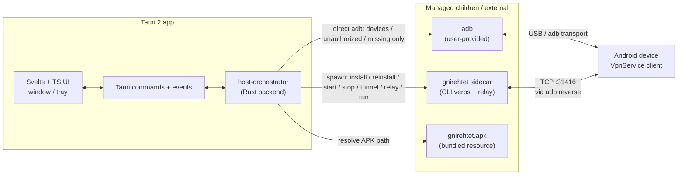

# Desktop Architecture — Gnirehtet GUI Shell

**Status:** Draft v0.2  
**Owner:** Desktop Application Engineer  
**Date:** 2026-09-12  
**Binding inputs:**
- [`research/lead-architect-baseline.md`](research/lead-architect-baseline.md)
- [`research/gnirehtet-core-boundaries.md`](research/gnirehtet-core-boundaries.md)
- [`research/architect-decisions-2026-09-12.md`](research/architect-decisions-2026-09-12.md) — Lead Architect decisions (orchestration, stop ownership, settings, VPN heuristic, IPC casing, hidden poll)

**Related docs:** [FRONTEND_ARCHITECTURE.md](FRONTEND_ARCHITECTURE.md) · [STATE_MODEL.md](STATE_MODEL.md) · [DESKTOP_LIFECYCLE.md](DESKTOP_LIFECYCLE.md)

---

## 1. Goals / non-goals

### Goals

| Goal | Notes |
|------|--------|
| Provide a desktop GUI for reverse tethering | Wrap upstream Genymobile/gnirehtet CLI semantics; no new networking model |
| One-click connect | `Run` ≈ upstream `run`: install-if-needed + tunnel + start + relay |
| Cross-platform shell | Linux, Windows; macOS best-effort until signing/sidecar story is proven |
| Safe process supervision | Manage `gnirehtet` as sidecar (CLI verbs + relay); capture logs; session-scoped teardown on Stop/Quit |
| Clear UX for ADB/VPN failures | Surface unauthorized, missing adb, VPN consent, tunnel loss |

### Non-goals (MVP)

| Non-goal | Rationale |
|----------|-----------|
| Redesign relay / TCP / packet protocol | Frozen per Lead Architect; use unmodified upstream Rust binary |
| In-process `relaylib::relay` | MVP uses **managed sidecar** only |
| Hand-rolled adb for CLI verbs | **Lead Architect decision:** do not reimplement `install\|reinstall\|start\|stop\|tunnel\|relay\|run` in the Tauri backend |
| Rewrite Android VpnService / APK | Ship stock `gnirehtet.apk` as resource |
| Vendor full Android platform-tools | `adb` is user-provided (PATH or settings) |
| IPv6 | Upstream does not support it |
| Multi-device autorun as MVP requirement | Optional later; MVP focuses on explicit device selection + Run |
| Invent ad-hoc adb sequences in the UI | UI talks only to host-orchestrator commands/events |

---

## 2. System context



ASCII equivalent:

```text
┌──────────────────────────────────────────────────────────────┐
│ Tauri 2 desktop app                                          │
│  ┌─────────────┐    commands/events    ┌──────────────────┐  │
│  │ Svelte UI   │◄─────────────────────►│ host-orchestrator│  │
│  │ + tray      │                       │ (Rust)           │  │
│  └─────────────┘                       └────────┬─────────┘  │
└─────────────────────────────────────────────────┼────────────┘
                    ┌─────────────────────────────┼────────────┐
                    ▼                             ▼            ▼
             gnirehtet sidecar              adb (PATH)   gnirehtet.apk
             (CLI verbs + relay)            │            (resource)
             install/reinstall/start/       │  discovery
             stop/tunnel/relay/run          │  + health only
                    │                       │
                    └───────────┬───────────┘
                                ▼
                         Android VpnService
                    (TUN on device only; PC has no TUN)
```

**Assumption:** Networking path remains upstream: device VpnService → TCP over `adb reverse` → host relay L3↔L5 translation. See core-boundaries §1–2.

**Lead Architect decision (orchestration, MVP):** the orchestrator **spawns the `gnirehtet` sidecar/CLI** for `install | reinstall | start | stop | tunnel | relay | run`. Direct `adb` is **only** for discovery/health (`devices`, unauthorized, adb missing). Do **not** reimplement those verbs with hand-rolled adb in the Tauri backend. **M2:** extract a shared Rust lib without changing the UI-facing API.

---

## 3. Frontend / backend boundaries

| Layer | Technology | May do | Must not do |
|-------|------------|--------|-------------|
| **UI (frontend)** | Svelte + TypeScript | Render state; invoke Tauri commands; subscribe to events; settings forms | Call `adb`; spawn processes; invent install/tunnel/start sequences; open destination sockets |
| **host-orchestrator** | Rust (Tauri backend) | Spawn `gnirehtet` for `install`, `reinstall`, `start`, `stop`, `tunnel`, `relay`, `run`; direct `adb` for `devices` / unauthorized / missing only; emit events; persist settings; validate paths; track session relay ownership + session port | Change packet protocol; link/modify `relaylib` internals in MVP; hand-roll adb sequences that duplicate CLI verbs |
| **Rust sidecar** | Upstream `gnirehtet` binary | CLI verbs + `relay` blocking mio loop | Be redesigned |
| **adb** | User binary | Discovery/health (`devices`, unauthorized); used *by the sidecar* for install/reverse/intents | Bundled in MVP; called by orchestrator for CLI verbs |
| **APK** | Bundled resource | Path resolved by orchestrator and passed to sidecar (`GNIREHTET_APK` / args) | Modified VpnService |

Cross-ref: [FRONTEND_ARCHITECTURE.md](FRONTEND_ARCHITECTURE.md) (UI only), [STATE_MODEL.md](STATE_MODEL.md) (state ownership).

---

## 4. Component responsibilities

| Component | Responsibility |
|-----------|----------------|
| **Window UI** | Device list, connection controls (Run / Stop / Reset tunnel), settings, log pane; primary operator surface |
| **System tray** | Minimize/close-to-tray; status icon reflecting relay + connection; Quit; one-click Stop (session teardown) |
| **host-orchestrator** | Single owner of process lifecycle; spawns `gnirehtet` CLI verbs; implements public API below; maps outcomes → events; tracks **session-scoped relay ownership** and **session port** |
| **Sidecar supervisor** | Spawn bundled `gnirehtet` with piped stdout/stderr for CLI verbs and `relay`; kill on Stop/Quit **only if this app started that relay**; track PID + ownership flag; orphan recovery on startup for *our* PID only |
| **Settings store** | Persist ADB path, APK override, port/DNS/routes defaults, tray prefs. **Lead Architect decision:** explicit app setting > `ADB` / `GNIREHTET_APK` env > PATH / bundled APK default |
| **Log bridge** | Line-buffer sidecar (+ optional adb child) output → parse → `LogLine` events → UI ring buffer / optional file |
| **APK resource resolver** | Locate bundled `gnirehtet.apk` or override path using the settings/env/bundle precedence; pass to sidecar |

---

## 5. Public orchestrator API (conceptual MVP)

Aligned with Lead Architect baseline. **UI-facing commands/events are stable through M2** (shared Rust lib extract must not change this surface).

### Commands (UI → orchestrator)

| Command | Mirrors upstream | Purpose |
|---------|------------------|---------|
| `ensure_adb()` | PATH / `ADB` / settings | Validate adb exists; return version/path or error |
| `list_devices()` | `adb devices` | Serials + adb connection state (**direct adb**, discovery only) |
| `install(serial)` | `install` | Spawn `gnirehtet install` (sidecar; resolved APK) |
| `start(serial, {dns?, routes?, port?})` | `start` | Spawn `gnirehtet start`; explicit `port` sets **session port** |
| `stop(serial)` | `stop` | Spawn `gnirehtet stop` (device client only — primitive) |
| `reset_tunnel(serial, port?)` | `tunnel` | Spawn `gnirehtet tunnel` (re-apply reverse; port must match session) |
| `start_relay(port?)` / `stop_relay()` | `relay` | Sidecar `gnirehtet relay` lifecycle; `stop_relay` only if **we started** that relay |
| `run(serial, opts?)` | `run` | One-click: spawn `gnirehtet run` semantics (install-if-needed + tunnel + start + relay) |
| Settings get/set | — | Load/save persisted prefs |

**One-click Stop / Quit** is **session teardown**, not `stop(serial)` alone: stop the device client **and** stop the relay if this app started it. Granular `stop(serial)` remains an orchestrator primitive; advanced “stop device only” UI is later. See [STATE_MODEL.md](STATE_MODEL.md) and [DESKTOP_LIFECYCLE.md](DESKTOP_LIFECYCLE.md).

### Events (orchestrator → UI)

| Event | Payload (conceptual) | Purpose |
|-------|----------------------|---------|
| `DeviceChanged` | device snapshot / list delta | Refresh device list & per-device state |
| `RelayState` | `relay_stopped` \| `starting` \| `running` \| `error` + ownership / port | Global relay indicator |
| `LogLine` | timestamp, level, source, message | Log pane + optional file tee |
| `Error` | code, message, related serial? | Toast / banner / state → `error` |

IPC mechanics (Tauri 2): invoke commands for request/response; listen on events for push; channels only if streaming large log chunks proves necessary (assumption: event-per-line is enough for MVP). Details in [FRONTEND_ARCHITECTURE.md](FRONTEND_ARCHITECTURE.md).

**Lead Architect decision (IPC casing):** Rust core stays `snake_case`. At the IPC boundary use `serde(rename_all = "camelCase")` (or equivalent) so TypeScript sees camelCase payloads. Do **not** force camelCase through Rust core. Command *names* remain snake_case (`ensure_adb`, `list_devices`, …).

### 5.1 Port session rules (agreed with Rust Architect)

Default listen port is **31416** (upstream). Tunnel, client START extras, and relay must always agree on one session port.

| Rule | Behavior |
|------|----------|
| Default | Session port starts unset; first use falls back to **31416** |
| `start_relay()` with no port | Reuse session port if already set this session, else 31416 |
| `run` / `start` with explicit port | **Sets** the session port for the rest of the session |
| Mid-session change | **Not allowed.** No hot-swap of the listen port. Stop + re-run to change |
| `reset_tunnel` | Uses the current session port (optional explicit port must match; mismatch → error) |

Persist the configured *default* port in settings; the *session* port is ephemeral ([STATE_MODEL.md](STATE_MODEL.md)).

---

## 6. Packaging layout

Ship (Apache-2.0 attribution required):

```text
gnirehtet-desktop/
├── gnirehtet-desktop          # Tauri app binary (or platform installer)
├── gnirehtet[.exe]            # Rust sidecar (externalBin / target-triple suffix)
├── gnirehtet.apk              # Bundled Android client resource
├── NOTICE                     # Upstream + dependency attribution
└── LICENSE / Apache-2.0 notice
```

| Artifact | Source | Notes |
|----------|--------|-------|
| App | This project | Tauri 2 + Svelte |
| Sidecar | Pinned Genymobile `relay-rust` build | Do not reinvent; MVP invokes this binary for CLI verbs **and** `relay` |
| APK | Upstream `gnirehtet.apk` | Resolved: app setting > `GNIREHTET_APK` env > bundled default |
| adb | **Not shipped** (MVP) | Resolved: app setting > `ADB` env > PATH |
| Windows note | Upstream suggests colocating adb DLLs | Document for users; optional future bundling |

**Stack provisional:** Tauri 2 + Svelte + TypeScript. Electron is fallback only if spikes fail (sidecar spawn/stop + log stream; e2e install/start/stop via CLI sidecar; APK as resource). Do not treat Electron as current plan — see [TAURI_EVALUATION.md](TAURI_EVALUATION.md).

**M2 (planned, not MVP):** extract a shared Rust orchestration lib from the sidecar-spawn path. UI-facing API unchanged. Relay may still run as a child until a graceful stop API exists.

---

## 7. Security boundaries

| Rule | Implementation |
|------|----------------|
| **No shell from UI** | Frontend never builds shell strings; only typed Tauri commands |
| **Path validation** | ADB / APK paths: exist, are files, reject `..` traversal; refuse unexpected executables where feasible |
| **Least privilege** | No admin/root required for core path (matches upstream); do not request elevation |
| **Localhost relay** | Default listen via adb reverse; do not expose relay on public interfaces without explicit future design |
| **Secrets** | No credentials in settings; logs may contain device serials — treat as local-only |
| **Kill semantics** | `stop_relay` may SIGKILL sidecar **only if we started it**; document that in-flight sockets drop (see [DESKTOP_LIFECYCLE.md](DESKTOP_LIFECYCLE.md)) |
| **Sidecar trust** | Only spawn the bundled/pinned binary path resolved by the app, not arbitrary user “relay” binaries without validation |
| **Foreign relay** | A process we did not start is not ours to kill, even if it listens on 31416 |

---

## 8. Platform matrix

| Platform | Support | Notes |
|----------|---------|-------|
| Linux | Primary | Sidecar + tray standard |
| Windows | Primary | Path/quoting for adb; USB driver UX; `.exe` sidecar |
| macOS | Best-effort | Signing, notarization, sidecar quarantine TBD |

---

## 9. Assumptions (labeled)

1. **Sidecar-only MVP** — in-process `relaylib` deferred; `relay(port)` has no graceful stop API, so process kill is the lifecycle primitive for a relay **we started** ([baseline](research/lead-architect-baseline.md), core-boundaries §4).
2. **State is inferred** — upstream has no structured status IPC; orchestrator combines adb queries, process status, and log heuristics ([core-boundaries §5](research/gnirehtet-core-boundaries.md)). `awaiting_vpn_permission` is a **heuristic** (Lead Architect decision); no APK/protocol change.
3. **Orchestration is CLI-sidecar spawn (Lead Architect decision).** The v0.1 draft allowed “hand-rolled adb **or** `gnirehtet` subprocesses.” That fork is **closed**. MVP spawns `gnirehtet` for `install|reinstall|start|stop|tunnel|relay|run`. Direct adb = discovery/health only. M2 lib extract does not change the UI-facing API.
4. **Wirebound** is a reference for shell↔binary wrapping, not a dependency.
5. **Session-scoped stop ownership (Lead Architect decision).** One-click Stop/Quit = stop device client + stop relay if we started it. Do not kill a foreign relay.
6. **Session port is sticky** until Stop + re-run (Rust Architect agreement). Default 31416.

---

## 10. Cross-references

| Topic | Doc |
|-------|-----|
| Views, components, command/event usage | [FRONTEND_ARCHITECTURE.md](FRONTEND_ARCHITECTURE.md) |
| Device/relay state machines, TS/serde shapes, port session | [STATE_MODEL.md](STATE_MODEL.md) |
| Startup, tray, sidecar kill, hidden poll, logging, crashes | [DESKTOP_LIFECYCLE.md](DESKTOP_LIFECYCLE.md) |
| Tauri sidecar spawn + M2 extract | [TAURI_EVALUATION.md](TAURI_EVALUATION.md) |
| Frozen networking + CLI surface | [research/gnirehtet-core-boundaries.md](research/gnirehtet-core-boundaries.md) |
| Product constraints | [research/lead-architect-baseline.md](research/lead-architect-baseline.md) |
| Binding decisions 2026-09-12 | [research/architect-decisions-2026-09-12.md](research/architect-decisions-2026-09-12.md) |
