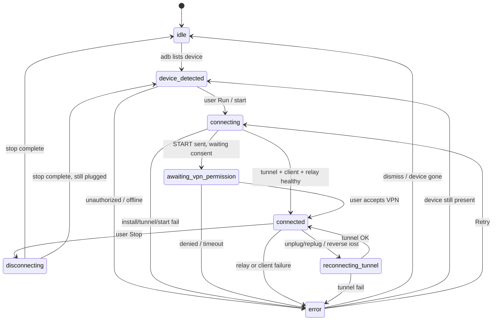
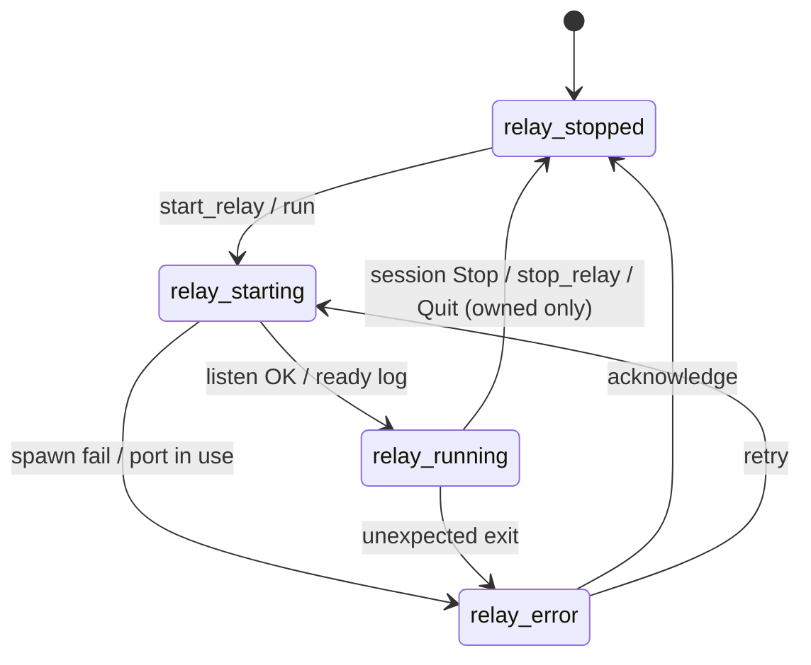

# State Model — Gnirehtet Desktop GUI

**Status:** Draft v0.2  
**Owner:** Desktop Application Engineer  
**Date:** 2026-09-12  
**Binding inputs:**
- [`research/lead-architect-baseline.md`](research/lead-architect-baseline.md)
- [`research/gnirehtet-core-boundaries.md`](research/gnirehtet-core-boundaries.md) §5–6
- [`research/architect-decisions-2026-09-12.md`](research/architect-decisions-2026-09-12.md)

**Related docs:** [DESKTOP_ARCHITECTURE.md](DESKTOP_ARCHITECTURE.md) · [FRONTEND_ARCHITECTURE.md](FRONTEND_ARCHITECTURE.md) · [DESKTOP_LIFECYCLE.md](DESKTOP_LIFECYCLE.md)

---

## 1. Layers of state

| Layer | Owner | Lifetime | Examples |
|-------|-------|----------|----------|
| **Application state** | Shell / UI stores | Process lifetime | Window visible, selected serial, active view, adb health |
| **Device state** | Orchestrator → `DeviceChanged` | Per serial; ephemeral | Lifecycle phase, apk installed?, tunnel ok?, last error |
| **Relay state** | Orchestrator → `RelayState` | Global; ephemeral | stopped / starting / running / error + port / PID / **ownedBySession** |
| **Session port** | Orchestrator | Ephemeral (this app session) | Listen port agreed by tunnel + client + relay; see §3.1 |
| **Settings** | Settings store + disk | Persistent across runs | ADB path, APK path, default port, DNS, routes, tray prefs |

**Rule:** Persistence is for **settings** (and later optional “last serial”). Device connection, relay process status, ownership, and session port are **ephemeral** and rediscovered on startup ([DESKTOP_LIFECYCLE.md](DESKTOP_LIFECYCLE.md)).

Upstream has no structured status IPC; device/relay phases are **inferred** from adb, process supervision, and logs (core-boundaries §5).

**Lead Architect decision (settings vs env):** path resolution is **explicit app setting > `ADB` / `GNIREHTET_APK` env > PATH / bundled APK default**.

---

## 2. Device state machine

Aligns with research recommended GUI states (core-boundaries §6 / quick list):



| State | Meaning |
|-------|---------|
| `idle` | No tether intent for this serial (or serial unknown) |
| `device_detected` | `adb` reports `device` |
| `connecting` | Orchestrator running install-if-needed / tunnel / start (and relay up or starting) via `gnirehtet` CLI spawn |
| `awaiting_vpn_permission` | Android VPN consent expected — **heuristic** (see §2.1) |
| `connected` | Tunnel + client + relay believed healthy |
| `reconnecting_tunnel` | `reset_tunnel` / `tunnel` recovery without full reinstall |
| `disconnecting` | Session Stop in progress (device client + owned relay) |
| `error` | Failed step; message + recoverable actions |

**Optional substeps** (may be folded into `connecting` for MVP UI): `checking_apk`, `installing` — useful in logs/stepper detail, not required as top-level enum if UI shows a single “Connecting…” with progress text.

**ADB connection** is a separate orthogonal field (`device` | `unauthorized` | `offline` | `absent`), not the same as tether lifecycle.

### 2.1 `awaiting_vpn_permission` (Lead Architect decision)

Upstream has no structured “VPN dialog is showing” signal. MVP **does not** change the APK or protocol.

| Rule | Behavior |
|------|----------|
| Entry | Heuristic: START / `gnirehtet start` or `run` succeeded, tunnel set, relay up, client not yet healthy |
| UX | Prompt the user to **check the phone** and accept the VPN / connection request. Do not show Connected. |
| Timeout | → recoverable `error` (`vpn_permission_timeout` or equivalent) with Retry |
| Denied (if detectable) | → `error` (`vpn_denied`) |
| Later | Real status channel only if heuristics prove noisy |

---

## 3. Global relay states



| State | Notes |
|-------|--------|
| `relay_stopped` | No sidecar (or confirmed dead) |
| `relay_starting` | Process spawned; waiting for readiness signal (log line / bind) |
| `relay_running` | Sidecar alive; session port (default 31416 unless set); `ownedBySession` true if **this app started it** |
| `relay_error` | Spawn failure, crash, port conflict |

One relay serves multiple clients upstream; MVP UI may still be single-device focused while keeping relay global.

### 3.1 Session-scoped relay ownership (Lead Architect decision)

The orchestrator records whether **this app started** the current relay (spawn of `gnirehtet relay` / `gnirehtet run`).

| Situation | Policy |
|-----------|--------|
| We started the relay | One-click Stop / Quit **stops the device client and the relay**. Default Run/Stop ≈ upstream `run` teardown (no orphans). |
| We did **not** start it (foreign CLI, leftover from another tool) | Stop the device client only. **Do not kill** that relay. Surface `foreign_relay` / leave `ownedBySession: false`. |
| Orphan PID file from *our* previous crash | Startup recovery may kill **our** recorded sidecar (exe path match). That is still “ours,” not a foreign relay. |
| Advanced “stop device only” | Optional later UI; not the MVP default. Primitive `stop(serial)` remains for the orchestrator. |

`stop_relay()` is refused or a no-op when `ownedBySession` is false.

### 3.2 Port session rules (agreed with Rust Architect)

Tunnel, client START extras, and relay **must agree** on one listen port.

| Rule | Behavior |
|------|----------|
| Default | **31416** (upstream) |
| `start_relay()` with no port | Reuse **session port** if already set this session, else 31416 |
| `run` / `start` with explicit port | **Sets** the session port for the rest of the session |
| Settings `defaultPort` | Used when session port is unset; does **not** hot-swap a running relay |
| Mid-session change | **Forbidden.** No listen-port hot-swap. User must Stop + re-run |
| `reset_tunnel` | Uses current session port; explicit port must match or error |

Session port is **ephemeral** (not persisted as truth). Settings may persist `defaultPort` for the next session.

---

## 4. Connection lifecycle ↔ orchestrator API

| User intent | API | Typical state transitions |
|-------------|-----|---------------------------|
| Refresh devices | `list_devices` / `ensure_adb` | → `device_detected` or banners (**direct adb**) |
| One-click Run | `run(serial, opts)` | device → `connecting` → (`awaiting_vpn_permission`) → `connected`; relay → `starting` → `running` (`ownedBySession: true`); explicit port sets session port |
| One-click Stop / tray Stop | session teardown | `connected` → `disconnecting` → `device_detected`/`idle`; **and** relay → `stopped` **if owned** |
| Reset tunnel | `reset_tunnel(serial, port?)` | `connected`/`error` → `reconnecting_tunnel` → `connected` (port must match session) |
| Stop relay only | `stop_relay()` | relay → `stopped` **if owned**; else no-op / error; devices may fall to `error` |
| Device-only stop (primitive / later UI) | `stop(serial)` | device → `disconnecting` → `device_detected`; relay left running |
| Quit app | session teardown | stop clients + `stop_relay` if owned |

**Run semantics (upstream `run`):** install-if-needed + tunnel + start + relay, implemented by **spawning `gnirehtet`**, not hand-rolled adb. Stop/Quit teardown as above. Do not invent alternate ordering in the UI.

---

## 5. Event propagation → UI stores

```text
Orchestrator                         Frontend stores
────────────                         ───────────────
DeviceChanged  ───────────────────►  devicesStore (map serial → Device)
RelayState     ───────────────────►  relayStore
LogLine        ───────────────────►  logsStore (ring buffer)
Error          ───────────────────►  errorsStore + optional device.errorMessage
Settings save  ◄── invoke ────────   settingsStore (also hydrated on boot)
```

| Event | Store update |
|-------|----------------|
| `DeviceChanged` | Upsert/remove devices; set `lifecycle` / adb fields |
| `RelayState` | Replace global relay snapshot (phase, port, pid, ownedBySession) |
| `LogLine` | Append; drop oldest beyond N (e.g. 2000) |
| `Error` | Push to errors; if `serial` present, set that device to `error` |

UI derives badges and button enablement from stores only — not from parsing logs in the view layer (orchestrator may use log heuristics internally).

---

## 6. Suggested TypeScript / Rust serde shapes (conceptual)

**Lead Architect decision (IPC casing):** Rust structs stay `snake_case`. Use `#[serde(rename_all = "camelCase")]` (or equivalent) at the IPC boundary. TypeScript below is the **camelCase IPC** view. Do **not** rename fields through the Rust core just to match TS.

```typescript
/** Orthogonal ADB presence */
type AdbDeviceState = 'device' | 'unauthorized' | 'offline' | 'absent';

type DeviceLifecycle =
  | 'idle'
  | 'device_detected'
  | 'connecting'
  | 'awaiting_vpn_permission'
  | 'connected'
  | 'reconnecting_tunnel'
  | 'disconnecting'
  | 'error';

interface Device {
  serial: string;
  adb: AdbDeviceState;
  lifecycle: DeviceLifecycle;
  apkInstalled?: boolean;
  apkVersionCode?: string; // upstream historically checks versionCode "9"
  tunnelOk?: boolean;
  lastError?: string;
}

type RelayPhase =
  | 'relay_stopped'
  | 'relay_starting'
  | 'relay_running'
  | 'relay_error';

interface RelaySnapshot {
  phase: RelayPhase;
  port: number;              // session port in use; default 31416
  pid?: number;
  ownedBySession: boolean;   // true iff this app started this relay
  lastError?: string;
}

interface LogLine {
  ts: string;         // ISO or upstream-like timestamp
  level: 'info' | 'error' | 'warn' | 'debug';
  source: 'relay' | 'orchestrator' | 'adb';
  message: string;
}

interface AppError {
  code: string;       // adb_not_found | unauthorized | port_in_use | vpn_permission_timeout | foreign_relay | ...
  message: string;
  serial?: string;
}

interface RunOptions {
  dns?: string[];     // → -d / intent dnsServers
  routes?: string[];  // → -r
  port?: number;      // → -p + matching reverse; sets session port
}

interface Settings {
  adbPath?: string;         // empty → env ADB → PATH
  apkPath?: string;         // empty → env GNIREHTET_APK → bundled
  defaultPort: number;      // 31416; applied when session port unset
  dnsServers: string[];     // default ["8.8.8.8"]
  routes: string[];         // default ["0.0.0.0/0"]
  closeToTray: boolean;
  startMinimized: boolean;
  // optional later: lastSerial, autorunPolicy — not MVP requirements
}
```

Rust sketch (core names stay snake_case):

```rust
#[derive(Serialize, Deserialize)]
#[serde(rename_all = "camelCase")]
pub struct RelaySnapshot {
    pub phase: RelayPhase,
    pub port: u16,
    pub pid: Option<u32>,
    pub owned_by_session: bool,
    pub last_error: Option<String>,
}
```

**Event names** (string identifiers): `DeviceChanged` | `RelayState` | `LogLine` | `Error` per baseline.

---

## 7. Persistence vs ephemeral

| Saved to disk | Not saved |
|---------------|-----------|
| Settings (`adbPath`, `apkPath`, `defaultPort`, `dnsServers`, `routes`, tray prefs) | Device lifecycle, relay phase/PID/ownership |
| Optional later: last selected serial | Session port (re-derived on next Run) |
| | Log ring buffer (optional file tee is separate — shell-owned file, not “settings”) |
| | Inferred apk/tunnel health |

On cold start: load settings → resolve adb/apk via **setting > env > PATH/bundle** → `ensure_adb` → `list_devices` → devices start at `idle`/`device_detected`; relay starts `relay_stopped` unless we adopted **our** orphan (unusual). Do not adopt a foreign relay as owned.

---

## 8. Assumptions

1. `awaiting_vpn_permission` is entered **heuristically** (Lead Architect decision) — START succeeded, not yet connected; timeout → recoverable error. Exact detection without APK changes is imperfect.
2. Multi-device: state model supports a map of devices; MVP UX may only drive one `run` at a time.
3. Protocol knobs (port/DNS/routes) are pass-through only — no new protocol fields.
4. **Session-scoped stop ownership** is binding (Lead Architect decision). Default Stop ≠ “leave the relay up.”
5. Orchestrator infers device/relay health; it does **not** reimplement CLI verbs with hand-rolled adb (Lead Architect decision). Direct adb = `list_devices` / `ensure_adb` only.

---

## 9. Cross-references

- Component ownership + port rules: [DESKTOP_ARCHITECTURE.md](DESKTOP_ARCHITECTURE.md)  
- Store usage in UI: [FRONTEND_ARCHITECTURE.md](FRONTEND_ARCHITECTURE.md)  
- Startup restoration, teardown, hidden poll: [DESKTOP_LIFECYCLE.md](DESKTOP_LIFECYCLE.md)
