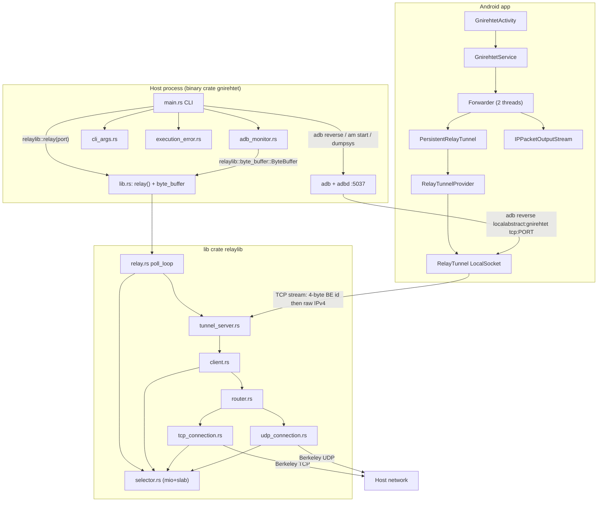

# CODEBASE_MAP.md

**Upstream pin:** `/workspace/gnirehtet-upstream` @ `1eb2e58` (README/tag context **v2.5.1**, 2023-07-09).  
**Default branch used:** `master`.  
**Companion docs cited (not re-derived):** `/workspace/gnirehtet-net-docs/{NETWORK_ARCHITECTURE,PROTOCOL,FAILURE_MODES,RECONNECT_DESIGN,IPV6_ANALYSIS}.md`, `/workspace/gnirehtet-net-research/{BRIEF,SOURCE_INDEX}.md`.  
**Rule:** Claims below are from files actually read in that tree. Unknowns are marked.

---

## 1. Repository tree (master @ 1eb2e58)

```
gnirehtet/
├── README.md                 # product docs; Rust preferred; IPv4 TCP+UDP only; unmaintained except blockers
├── DEVELOP.md                # architecture for developers (selector, NAT analogy, packet path)
├── LICENSE                   # Apache License 2.0
├── build.gradle              # root: compileSdk 28, AGP 3.5.0, jcenter+google, flavor tasks
├── settings.gradle           # include ':app', ':relay-java', ':relay-rust'
├── gradle.properties         # org.gradle.jvmargs=-Xmx1536m
├── gradlew / gradlew.bat
├── gradle/wrapper/gradle-wrapper.properties   # Gradle 5.4.1
├── release                   # bash packager: APK + rust/java zips
├── config/
│   ├── android-checkstyle.gradle
│   ├── android-signing.gradle          # optional RELEASE_STORE_* from ~/.gradle
│   ├── java-checkstyle.gradle          # checkstyle 6.19
│   └── checkstyle/checkstyle.xml
├── assets/                   # archi.png, key.png, request.jpg (docs images)
├── app/                      # Android VPN client
│   ├── build.gradle          # applicationId com.genymobile.gnirehtet, min 21, target 29, versionCode 9 / 2.5.1
│   ├── proguard-rules.pro
│   └── src/
│       ├── main/AndroidManifest.xml
│       ├── main/java/com/genymobile/gnirehtet/   # 15 production classes
│       ├── main/res/{values,values-fr,drawable}
│       └── test/java/.../TestIPPacketOutputSteam.java
├── relay-rust/               # preferred host relay + CLI
│   ├── Cargo.toml            # package gnirehtet 2.5.1, lib name relaylib, edition 2018
│   ├── Cargo.lock
│   ├── build.gradle          # wraps cargo build/test/fmt + mingw cross
│   ├── scripts/gnirehtet-run.cmd
│   └── src/
│       ├── main.rs           # CLI + adb orchestration (NOT in the lib)
│       ├── lib.rs            # pub fn relay(port) + pub use byte_buffer
│       ├── adb_monitor.rs
│       ├── cli_args.rs
│       ├── execution_error.rs
│       ├── logger.rs
│       └── relay/            # 25 modules: selector, client, router, tcp/udp, headers, buffers
└── relay-java/               # parity Java 8 relay + CLI
    ├── build.gradle          # application plugin; mainClass com.genymobile.gnirehtet.Main
    ├── scripts/{gnirehtet,gnirehtet.cmd,gnirehtet-run.cmd}
    └── src/main/java/com/genymobile/gnirehtet/
        ├── Main.java, AdbMonitor.java, CommandLineArguments.java
        └── relay/            # 25 classes mirroring Rust
```

Production source counts in this tree: **16** Java files under `app/`, **31** Rust files under `relay-rust/`, **39** Java files under `relay-java/` (including tests).

There is **no** desktop GUI, no Kotlin, no IPv6 path, no length-prefixed application protocol beyond the 4-byte client id.

---

## 2. Responsibility matrix

| Module | Responsibility | Does not own | Language |
|--------|----------------|--------------|----------|
| `app/.../GnirehtetActivity` | Invisible Activity; `START`/`STOP` intents; `VpnService.prepare` UX; extras → `VpnConfiguration` | Host adb / relay | Java |
| `app/.../GnirehtetService` | `VpnService`: addr `10.0.0.2/32`, MTU `0x4000`, routes/DNS, TUN fd, start `Forwarder` | Packet parse beyond version | Java |
| `app/.../Forwarder` | Two worker threads: TUN↔tunnel copy; IPv4 filter; UDP wakeup-on-stop | Host sockets | Java |
| `app/.../RelayTunnel` | `LocalSocket` to abstract name `gnirehtet`; read BE client id; raw send/recv | Reconnect policy | Java |
| `app/.../PersistentRelayTunnel` + `RelayTunnelProvider` | Reconnect wrapper; 5s backoff; connected/disconnected notify | Host reverse | Java |
| `app/.../IPPacketOutputStream` | Split TCP stream into IPv4 packets for TUN writes | Routing | Java |
| `app/.../VpnConfiguration` / `CIDR` / `Net` | Parcelable DNS + CIDR routes | Persistence | Java |
| `app/.../Notifier` | Foreground-service notification + failure icon | VPN setup | Java |
| `relay-rust/src/main.rs` | CLI verbs; `adb reverse`; `am start` START/STOP; APK version check; spawn relay | Packet processing | Rust binary |
| `relay-rust/src/adb_monitor.rs` | `host:track-devices` on `127.0.0.1:5037`; callback on new `device` serial | Relay sockets | Rust binary |
| `relay-rust/src/cli_args.rs` | `-d`/`-r`/`-p`/serial; `DEFAULT_PORT = 31416` | Validation of CIDR/DNS values | Rust binary |
| `relay-rust/src/lib.rs` | **Public lib API:** `relay(port: u16) -> io::Result<()>` + `byte_buffer` | adb / CLI | Rust lib `relaylib` |
| `relay/.../relay.rs` | mio poll loop + 60s cleanup tick | Accept / routing | Rust |
| `relay/.../tunnel_server.rs` | Bind `127.0.0.1:port`; accept; allocate `u32` client id | Packet parse | Rust |
| `relay/.../client.rs` | Per-device TCP session; send 4-byte BE id; reassemble IPv4; backpressure | Host connect | Rust |
| `relay/.../router.rs` | 5-tuple demux; create TCP/UDP; expire | TUN | Rust |
| `relay/.../tcp_connection.rs` | Userspace TCP (RFC793-ish TCB) + host `TcpStream` | UDP | Rust |
| `relay/.../udp_connection.rs` | Datagram relay; idle timeout 120s | TCP | Rust |
| `relay/.../packetizer.rs` + headers/buffers | L5→L3 forge; stream/datagram buffers | CLI | Rust |
| `relay-java/.../Main` + `relay/*` | Same architecture via Java NIO | — | Java 8 |

**Java vs Rust:** parallel implementations of the same protocol (see `DEVELOP.md` “Relay server”). Rust is the documented default (`README.md`: “Use the **Rust** implementation”).

---

## 3. Inter-module dependency graph



**Coupling hotspot (verified):** `adb_monitor.rs` is a **binary-crate** module (`main.rs` `mod adb_monitor`) but imports `relaylib::byte_buffer::ByteBuffer` (`adb_monitor.rs:18`). `lib.rs:18` re-exports `byte_buffer` **only** for this. The adb tracker therefore depends on the packet-relay library for a generic ring buffer.

---

## 4. Public APIs / entry points

### 4.1 Host CLI (user-facing)

Both `relay-rust/src/main.rs` (`COMMANDS`) and `relay-java/.../Main.java` (`enum Command`) expose the same verbs:

| Command | Parameters | Effect |
|---------|------------|--------|
| `install` / `uninstall` / `reinstall` | `[serial]` | `adb install -r gnirehtet.apk` / `adb uninstall com.genymobile.gnirehtet` |
| `run` | serial, `-d`, `-r`, `-p` | async start client + blocking relay; Ctrl+C → `stop` + `exit(0)` |
| `autorun` | `-d`, `-r`, `-p` | thread: `autostart`; then `relay` |
| `start` | serial, `-d`, `-r`, `-p` | version-check APK; `adb reverse`; `am start -a com.genymobile.gnirehtet.START` |
| `autostart` | `-d`, `-r`, `-p` | `AdbMonitor` → `async_start` per new serial |
| `stop` | `[serial]` | `am start -a com.genymobile.gnirehtet.STOP` |
| `restart` | same as start | stop then start |
| `tunnel` | serial, `-p` | `adb reverse localabstract:gnirehtet tcp:<port>` |
| `relay` | `-p` | `relaylib::relay(port)` / `new Relay(port).run()` |

Defaults: port **31416** (`cli_args.rs` `DEFAULT_PORT`; Java `CommandLineArguments.DEFAULT_PORT`). Env: `ADB`, `GNIREHTET_APK` (default `gnirehtet.apk`). APK must have `versionCode` **9** (`REQUIRED_APK_VERSION_CODE`).

Intent extras: `--esa dnsServers` / `--esa routes` (comma-separated string arrays).

### 4.2 Rust library API (the only `pub` surface)

```rust
// relay-rust/src/lib.rs
pub use crate::relay::byte_buffer;
pub fn relay(port: u16) -> io::Result<()> {
    Relay::new(port).run()
}
```

Everything else in `relay/` is crate-private. There is **no** cooperative shutdown, **no** accept-callback, **no** stats, **no** multi-port API. `relay()` runs an infinite poll loop (`relay.rs` `poll_loop`).

### 4.3 Android public surface (intents)

- Actions: `com.genymobile.gnirehtet.START`, `com.genymobile.gnirehtet.STOP` on exported `GnirehtetActivity` (`AndroidManifest.xml`).
- Activity is gated by `android:permission="android.permission.WRITE_SECURE_SETTINGS"` (signature/privileged on stock Android — see debt).
- Service: `GnirehtetService` with `BIND_VPN_SERVICE` + `android.net.VpnService`.
- Internal service actions: `START_VPN` / `CLOSE_VPN` + extra `vpnConfiguration`.

### 4.4 Wire protocol (cited, not re-derived)

See `/workspace/gnirehtet-net-docs/PROTOCOL.md`:

1. Device connects to abstract socket `gnirehtet`.
2. Host accepts on `127.0.0.1:PORT`.
3. Host sends **4-byte big-endian `u32` client id**, then raw concatenated IPv4 packets.
4. Framing is IPv4 total-length at offset 2. No TLV, no encryption.

---

## 5. Concurrency model

| Place | Model | Evidence |
|-------|-------|----------|
| Rust relay | **Single-threaded** mio 0.6 event loop; `Rc<RefCell<_>>` + `Weak`; no `Send` across threads | `DEVELOP.md` “essentially monothreaded”; `relay.rs` `poll_loop`; `selector.rs` |
| Java relay | **Single-threaded** NIO `Selector` | `Relay.java` `while (true) { selector.select; handler.onReady }` |
| Rust CLI | Extra **OS threads**: `async_start`, `cmd_autorun` autostart thread; Ctrl+C handler calls `cmd_stop` + `exit(0)` | `main.rs` `thread::spawn`, `ctrlc::set_handler` |
| `AdbMonitor` | Blocking loop on dedicated thread (autorun) or the main thread (autostart) | `adb_monitor.rs` `monitor()` infinite loop |
| Android `Forwarder` | Shared `Executors.newFixedThreadPool(3)`: device→tunnel, tunnel→device, plus UDP wakeup | `Forwarder.java:36` |
| Android reconnect | `PersistentRelayTunnel` send/recv loops; `RelayTunnelProvider` dual mutex (`getCurrentTunnelLock` + `this`) | `RelayTunnelProvider.java:30–54` |
| Android UI | Main-thread `Handler` (`RelayTunnelConnectionStateHandler`) updates `Notifier` | `GnirehtetService.java:206–231` |

**Implication for a GUI:** the relay loop cannot be stopped cooperatively from another thread without process death or a new API. Device-side forwarding is already multi-thread + reconnect.

---

## 6. Lifecycles

### 6.1 Device (adb)

```
adbd track-devices → serial state "device"
  → AdbMonitor callback (new serial only; reconnect after drop fires again)
  → async_start:
       dumpsys package versionCode != 9? → adb install -r
       sleep 500ms
       adb reverse localabstract:gnirehtet tcp:PORT
       am start START (+ dns/routes extras)
```

`AdbMonitor` does **not** callback on disconnect; it only diffs “newly connected” serials (`handle_packet`). Repair path: on I/O error, `adb start-server` then sleep 1s/5s (`RETRY_DELAY_ADB_DAEMON_OK/KO`).

### 6.2 Android VPN / client

```
START intent → GnirehtetActivity
  → VpnService.prepare (may show system dialog; activity stays alive)
  → GnirehtetService.start (O+: startForegroundService)
  → Notifier.start() foreground
  → setupVpn (address/routes/DNS/MTU/blocking) → establish()
  → Forwarder.forward() two threads
  → PersistentRelayTunnel loops getCurrentTunnel() → connect + readClientId
STOP / notification action → CLOSE_VPN → forwarder.stop + vpnInterface.close
```

`START_NOT_STICKY` (`GnirehtetService:98`). **No `onRevoke()` override** in this tree (search found none) — platform default `stopSelf`. Duplicate START while running is ignored (`isRunning()` = `vpnInterface != null`).

### 6.3 Relay

```
relay(port) → Selector::create → TunnelServer bind 127.0.0.1:port
  loop: poll(timeout to next cleanup)
        if deadline: clean_expired_connections (UDP 120s idle)
        run_handlers
```

Accept → `Client::create` (writable only until 4-byte id is sent) → then read IPv4 into `Ipv4PacketBuffer` → `Router`. Client close: shutdown socket, `router.clear`, notify `TunnelServer.remove_client`.

### 6.4 Tunnel (device↔host TCP)

Cited from `RECONNECT_DESIGN.md` / `FAILURE_MODES.md`:

- Reverse can accept even if relay is down → `readClientId` is the real liveness check (`RelayTunnel` javadoc).
- On I/O/EOF: `invalidateTunnel` + 5s backoff (`DELAY_BETWEEN_ATTEMPTS_MS`).
- Reconnect is a **new** TCP session + new client id; in-flight TCP/UDP associations are **not** resumed.

---

## 7. Packet path (end-to-end)

Cited from `NETWORK_ARCHITECTURE.md` + files:

**Device → Internet**

1. Apps write IPv4 to TUN.
2. `Forwarder.forwardDeviceToTunnel`: `FileInputStream.read` into `0x10000` buffer; drop if `buffer[0]>>4 != 4` (issue #69).
3. `PersistentRelayTunnel.send` → `RelayTunnel.send` writes raw bytes on `LocalSocket`.
4. Host `Client.read` → `Ipv4PacketBuffer` slices on IPv4 total length.
5. `Router.send_to_network` keys `ConnectionId` (proto, src IP/port, dst IP/port).
6. TCP: payload into `StreamBuffer` → host `TcpStream` (`TcpStream::connect(&id.rewritten_destination())`). UDP: `DatagramBuffer` → connected `UdpSocket`.
7. Destination `10.0.2.2` rewritten to `127.0.0.1` (`connection.rs` `LOCALHOST_FORWARD`).

**Internet → Device**

1. Host socket readable → `Packetizer` forges IPv4+transport (addrs swapped from first packet).
2. `Client.send_to_client` appends to `network_to_client` (`16 * MAX_PACKET_LENGTH`); else `WouldBlock` + `PacketSource` pending list.
3. Bytes on the device TCP stream.
4. `Forwarder.forwardTunnelToDevice` → `IPPacketOutputStream` splits on IPv4 boundaries → TUN.

Android client **does not parse TCP/UDP**. All L3↔L5 intelligence is in the desktop relay.

---

## 8. Substantive findings (map-focused)

### F-MAP-1 — Split crate: CLI vs `relaylib`

1. **File/module:** `relay-rust/src/main.rs` + `relay-rust/src/lib.rs`
2. **What it does:** Binary owns adb/CLI; lib owns the event-loop relay.
3. **Why it matters:** This is the natural reuse boundary for a GUI successor.
4. **Reuse:** Yes — `relay(port)` is the entire published API.
5. **Refactor required:** Extract adb/CLI into a separate crate; do not enlarge `relaylib` with GUI concerns.
6. **Risk:** Low if sidecar-wrapped; high if GUI links in-process without a stop API.
7. **Evidence:** `lib.rs:23-25` `pub fn relay(port: u16)`; `main.rs:482-485` `fn cmd_relay` → `relaylib::relay(port)?`; `main.rs:23-26` `mod adb_monitor` etc. are binary-only.

### F-MAP-2 — `adb_monitor` illegally (architecturally) depends on relaylib

1. **File/module:** `relay-rust/src/adb_monitor.rs`
2. **What it does:** ADBD `host:track-devices` client; parses hex-length packets; callbacks on new `device` serials; restarts `adb start-server` on failure.
3. **Why it matters:** Multi-device `autorun`/`autostart`; GUI will want the same tracker.
4. **Reuse:** Algorithm yes; current module **no** as a clean library (tied to `relaylib::byte_buffer` and hardcoded `"adb"`).
5. **Refactor required:** Break the `byte_buffer` import; give `AdbMonitor` its own small buffer or a shared `gnirehtet-util` crate. Also honor `ADB` env (today `start_adb_daemon` hardcodes `"adb"` while CLI uses `get_adb_path()`).
6. **Risk:** Medium — autorun silently uses a different adb than `ADB=`.
7. **Evidence:** `adb_monitor.rs:18` `use relaylib::byte_buffer::ByteBuffer`; `:47` `b"0012host:track-devices"`; `:70` `127.0.0.1:5037`; `:210` `Command::new("adb").args(&["start-server"])`; contrast `main.rs:40-45` `get_adb_path()` / `ADB`.

### F-MAP-3 — Selector + connection graph is the hard core

1. **File/module:** `relay/{selector,client,router,tcp_connection,udp_connection}.rs` (Java twins)
2. **What it does:** Userspace NAT: 5-tuple demux, TCP state machine, UDP idle expiry, L3↔L5 translation.
3. **Why it matters:** This is the product. `DEVELOP.md` states the relay “does all the hard work”.
4. **Reuse:** **Keep as-is** (sidecar binary). Do not rewrite for MVP.
5. **Refactor required:** None for MVP. Later: mio upgrade, cooperative shutdown.
6. **Risk:** High if rewritten; TCP semantics are hand-rolled (`TcpState` Init…FinWait2, `Tcb`, MTU `0x4000` matching client).
7. **Evidence:** `tcp_connection.rs:41-42` “same value as GnirehtetService.MTU”; `:72-84` `TcpState`; `router.rs:124-143` TCP/UDP only; `udp_connection.rs:38` `IDLE_TIMEOUT_SECONDS = 2 * 60`.

### F-MAP-4 — Android client is a dumb tunnel

1. **File/module:** `app/.../{Forwarder,RelayTunnel,IPPacketOutputStream,GnirehtetService}`
2. **What it does:** VpnService + byte copy + packet-boundary split + reconnect.
3. **Why it matters:** GUI successor should **ship this APK**, not reimplement VpnService.
4. **Reuse:** Yes, with possible manifest/FGS updates.
5. **Refactor required:** Foreground-service type / `onRevoke` / permission attribute (see TECHNICAL_DEBT).
6. **Risk:** Medium on modern Android; low functional risk on API 21–29 target as written.
7. **Evidence:** `Forwarder.java:103-110` IPv4-only filter; `RelayTunnel.java:77-81` raw write; `DEVELOP.md:98-99` “just maintains a TCP connection… sends the raw packets”.

### F-MAP-5 — Java relay is a maintained twin, not a second protocol

1. **File/module:** `relay-java/`
2. **What it does:** Same CLI verbs, same adb reverse, same selector architecture in NIO.
3. **Why it matters:** Fallback if Rust/mio breaks; useful as a readable spec (Java types are explicit).
4. **Reuse:** Keep as reference / emergency fallback. Do not make it the GUI default (JRE 8, upstream says prefer Rust).
5. **Refactor required:** None for GUI MVP.
6. **Risk:** Dual-maintenance drift (already two copies of AdbMonitor, CLI, TCP).
7. **Evidence:** `README.md` “It is still maintained to provide a working alternative”; `Main.java` command set matches `main.rs`; `Relay.java` mirrors `relay.rs` 60s cleanup.

### F-MAP-6 — Tests cover buffers/headers, not TCP state or orchestration

1. **File/module:** Rust `#[cfg(test)]` in adb_monitor, cli_args, buffers/headers; Java `*Test.java` similarly; app has only `TestIPPacketOutputSteam`.
2. **What it does:** Unit tests for packet slicing, header parse, adb packet framing, CLI argv.
3. **Why it matters:** No test of `TcpConnection` state machine, `Router` demux, or `cmd_start` adb sequences.
4. **Reuse:** Tests are reusable as a conformance seed.
5. **Refactor required:** GUI project should add integration tests before any relay refactor.
6. **Risk:** High for silent TCP regressions if mio/deps are bumped.
7. **Evidence:** `rg '#[cfg(test)]'` hits listed files only; no `tcp_connection.rs` tests; Java tests listed in SOURCE_INDEX.

### Unknowns

- Runtime behavior of `WRITE_SECURE_SETTINGS` on the exported Activity on current devices (not executed here).
- Whether `dumpsys package` `versionCode=` format is stable on all API levels (`must_install_client` string-finds `    versionCode=`).
- macOS binary story: not present in this tree (release script builds linux + mingw win64 only).

---

## 9. Platform-specific behavior (from this tree)

| Topic | Behavior | Evidence |
|-------|----------|----------|
| OS support | README: GNU/Linux, Windows, Mac OS | `README.md` |
| Rust Windows | `x86_64-pc-windows-gnu` cross via mingw | `relay-rust/build.gradle` `releaseCrossToWindows`; `DEVELOP.md` |
| `execution_error` | Unix: map no-exit-code to signal; non-unix: `panic!` | `execution_error.rs:60-63` |
| `ctrlc` | feature `termination` | `Cargo.toml` |
| Android O+ | `startForegroundService` + notification channel | `GnirehtetService:60-63`; `Notifier` |
| API < 22 | cannot `setUnderlyingNetworks` | `GnirehtetService:162-163` |
| TUN close wakeup | dummy UDP to `42.42.42.42:4242` | `Forwarder.wakeUpReadWorkaround` |
| Localhost alias | `10.0.2.2` → `127.0.0.1` | `connection.rs:27-28,81-88` |

---

*End of CODEBASE_MAP.md*
