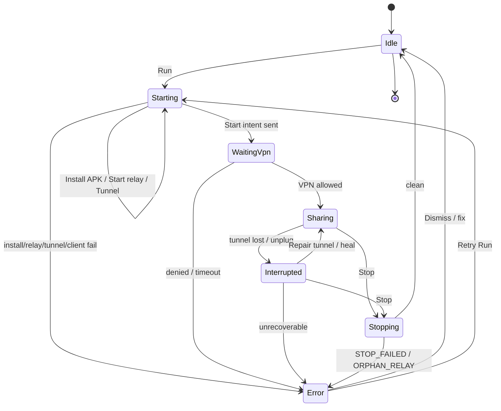
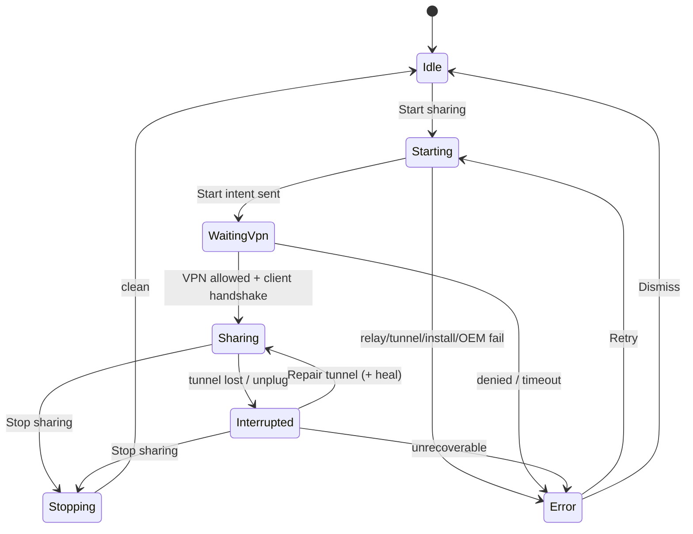

# User Flows — gnirehtet Desktop GUI

Flows are numbered. Each lists **entry**, **steps**, **success**, **failure exits → ERROR_UX codes**, and **MVP vs Later**. Cross-ref: `ERROR_UX.md`, `SCREEN_SPEC.md`, `MVP_UX.md`.

---

## Legend

| Symbol | Meaning |
|--------|---------|
| → | Proceed |
| ◆ | Decision |
| ✗ | Failure exit (error code) |
| ✓ | Success criteria |
| **[MVP]** / **[Later]** | Scope |

Session states used below: `Idle` | `Starting` | `WaitingVpn` | `Sharing` | `Interrupted` | `Stopping` | `Error`

---

## 1. First-run / setup **[MVP]**

**Entry:** App launch with no completed setup flag (or user opens Setup from empty Main).

| Step | Actor | Action / UI |
|------|-------|-------------|
| 1 | App | Show **Setup checklist** (not a marketing carousel) |
| 2 | App | Check adb: found on PATH or saved path? |
| 3 ◆ | — | adb OK? → green check. Else → prompt **Choose adb…** / install platform-tools guide (no auto-download) |
| 4 | User | Enable Developer options + USB debugging (external guide link) |
| 5 | User | Connect **data** USB cable; unlock phone |
| 6 | App | Poll devices; show unauthorized / offline / device |
| 7 | User | On phone: accept RSA “Always allow from this computer” if prompted |
| 8 | App | Checklist item “Device authorized” → green |
| 9 | App | Note: “When you Start, the phone will ask for VPN permission — that is expected.” |
| 10 | User | Continue → Main |

**Success:** Checklist all critical items green (adb found, ≥1 authorized device) or user explicitly continues with warnings.  
**Failure exits:**

| Condition | Code |
|-----------|------|
| adb binary not found | `ADB_MISSING` |
| Saved path invalid | `ADB_PATH_INVALID` |
| No devices after poll | `NO_DEVICES` |
| Only unauthorized | `DEVICE_UNAUTHORIZED` |

---

## 2. Device discovery **[MVP]**

**Entry:** Main window; Refresh; USB plug event; periodic poll (**MVP:** auto-refresh on interval + manual Refresh).

| Step | Actor | Action |
|------|-------|--------|
| 1 | App | `adb devices -l` (or equivalent) |
| 2 | App | Render rows: model/product if available, serial, state chip |
| 3 ◆ | — | 0 devices → empty state copy |
| 4 ◆ | — | 1 authorized → auto-select **[MVP]** |
| 5 ◆ | — | N authorized → require selection before Run (**MVP:** one session; no multi-tether) |
| 6 | User | Select device row |

**Success:** At least one device listed with accurate state; selection sticky until unplug.  
**Failure exits:** `NO_DEVICES`, `DEVICE_OFFLINE`, `DEVICE_UNAUTHORIZED`, `MULTIPLE_DEVICES_NO_SELECTION` (Run pressed with none selected).

**Later:** Nicknames (QtScrcpy-style), wireless-adb discovery as secondary.

---

## 3. USB authorization **[MVP]**

**Entry:** Device state `unauthorized` or first plug.

| Step | Actor | Action |
|------|-------|--------|
| 1 | App | Row chip: **Unauthorized**; primary helper: “Unlock phone and accept the RSA fingerprint prompt” |
| 2 | User | Tap Allow / Always allow on device |
| 3 | App | Next poll → `device` → chip **Ready** |
| 4 ◆ | Timeout / still unauthorized | Keep guidance; optional “Reseat USB / try another cable” |

**Success:** State becomes authorized (`device`).  
**Failure exits:** `DEVICE_UNAUTHORIZED` (blocking Run), `NO_DEVICES` if disconnected during wait.

---

## 4. APK install **[MVP]**

**Entry:** Part of **Run**, or explicit **Install / Update client** in Advanced / device menu.

| Step | Actor | Action |
|------|-------|--------|
| 1 | App | Detect whether gnirehtet APK present / version compatible |
| 2 ◆ | Missing or mismatch | Install or reinstall from bundled/configured APK path |
| 3 ◆ | Install OK | Continue pipeline |
| 4 ◆ | Fail | Surface installer stderr snippet |

**Success:** Compatible client installed; version shown in Diagnostics / About.  
**Failure exits:** `APK_MISSING`, `INSTALL_FAILED`, `APK_VERSION_MISMATCH`.

**Note:** Do not invent package-name checks beyond what the build implements — **needs device validation** for exact detection method.

---

## 5. Start reverse tether (happy path) **[MVP]**

**Entry:** Idle, authorized device selected, user presses **Run**.

| Step | State | Action |
|------|-------|--------|
| 1 | `Starting` | Disable Run; show progress |
| 2 | `Starting` | Ensure APK (flow 4) |
| 3 | `Starting` | Start relay on configured port (default **31416**) |
| 4 | `Starting` | `adb reverse` / tunnel setup for device serial |
| 5 | `Starting` | Send start intent to client |
| 6 | `WaitingVpn` | If first grant needed → flow 6 |
| 7 | `Sharing` | Confirm client connected / session healthy (implementation signal — **needs device validation**) |
| 8 | UI | Chip **Sharing**; Stop enabled; logs streaming |

**Success:** Phone shows key icon; apps use PC IPv4 TCP/UDP; UI `Sharing`.  
**Failure exits:** `PORT_IN_USE`, `RELAY_START_FAILED`, `TUNNEL_FAILED`, `CLIENT_START_FAILED`, `VENDOR_PERMISSION_MONITORING`, `START_TIMEOUT`, plus install codes from flow 4.

---

## 6. On-device VPN permission **[MVP]**

**Entry:** After start intent; Android system VPN consent (first time / revoked).

| Step | Actor | Action |
|------|-------|--------|
| 1 | App | State `WaitingVpn`; copy: “On your phone, allow the VPN connection request. This lets the phone send traffic through your PC — not a commercial VPN.” |
| 2 | App | Cannot click for user; optional screenshot/diagram of system dialog |
| 3 ◆ | User allows | → `Sharing` |
| 4 ◆ | User denies | → `Error` / Idle with `VPN_PERMISSION_DENIED` |
| 5 ◆ | Stays pending past timeout | `VPN_PERMISSION_PENDING` or `START_TIMEOUT` with pending subtype |

**Success:** Permission granted; tether active.  
**Failure exits:** `VPN_PERMISSION_DENIED`, `VPN_PERMISSION_PENDING`, `START_TIMEOUT`.

---

## 7. Stop / quit **[MVP]**

### 7a Stop session

**Entry:** `Sharing` or `Interrupted` / `WaitingVpn`; user **Stop**.

| Step | State | Action |
|------|-------|--------|
| 1 | `Stopping` | Send stop intent; tear down reverse; stop relay |
| 2 ◆ | Clean | → `Idle` |
| 3 ◆ | Partial | Warn + offer Diagnostics; may leave `ORPHAN_RELAY` |

**Success:** Idle; no relay listening; device key icon gone (**needs device validation** timing).  
**Failure exits:** `STOP_FAILED`, `ORPHAN_RELAY`.

### 7b Quit application

| Case | Behavior **[MVP]** |
|------|-------------------|
| Idle | Quit immediately (or OS close) |
| Session active | Confirm: “Stop reverse tether and quit?” → Stop then exit |
| Tray | **Later** — MVP recommends **no tray requirement**; close = quit after confirm if tethering; minimize to taskbar OK |

---

## 8. Reconnect after unplug / replug **[MVP]**

**Entry:** Active or recent session; USB disconnect (kills `adb reverse` per upstream).

| Step | State | Action |
|------|-------|--------|
| 1 | Detect loss | Device missing/offline OR tunnel health fail → `Interrupted` |
| 2 | UI | Explain: “USB disconnect removed the adb reverse tunnel. Replug, then Repair tunnel (or Run again).” |
| 3 | User | Replug; authorize if needed |
| 4 | User | **Repair tunnel** (flow 9) and/or **Run** |
| 5 ◆ | Client still running on phone | May reconnect to relay if tunnel restored (upstream behavior) — UI should not promise auto-heal without signal |

**Success:** Back to `Sharing` without full reinstall.  
**Failure exits:** `TUNNEL_LOST`, `TUNNEL_FAILED`, `NO_DEVICES`, `DEVICE_UNAUTHORIZED`, `RELAY_CRASHED`.

**Later:** `autorun`-style auto reconnect UI.

---

## 9. Repair tunnel **[MVP]**

**Entry:** User action from Main / Error recovery; maps to CLI `tunnel`.

| Step | Action |
|------|--------|
| 1 | Require selected authorized device |
| 2 | Re-establish `adb reverse` to relay port |
| 3 | Log result; if session expected active, move `Interrupted` → `Sharing` when healthy |

**Success:** Reverse restored; optional “Tunnel OK” toast (quiet).  
**Failure exits:** `TUNNEL_FAILED`, `DEVICE_OFFLINE`, `DEVICE_UNAUTHORIZED`, `NO_DEVICES`.

---

## 10. Multi-device **[Later]** (document concept only)

**Entry:** ≥2 authorized devices.

| Concept | UX |
|---------|----|
| MVP | List all; **one** active tether; Run blocked until single selection (`MULTIPLE_DEVICES_NO_SELECTION`) |
| Later | Per-device Start; serial always shown; optional **autorun** for all (CLI `autorun`) |
| Later | Stop all (QtScrcpy parallel) |

**Failure exits (MVP):** `MULTIPLE_DEVICES_NO_SELECTION`.  
Do not imply simultaneous multi-tether in MVP chrome.

---

## 11. Diagnostics / export logs **[MVP]**

**Entry:** Diagnostics panel / “Copy logs” / error “Show details”.

| Step | Action |
|------|--------|
| 1 | Show adb path/version, selected serial/state, APK version, relay port/PID, last errors |
| 2 | Log ring buffer; **Copy all** / **Save to file** |
| 3 | Netcheck-style hints **[Later]** optional; MVP = raw logs + structured fields |

**Success:** User can paste a self-contained report.  
**Failure exits:** None blocking; if relay dead show `ORPHAN_RELAY` / `RELAY_CRASHED` in panel.

---

## 12. Settings change: idle vs tethering **[MVP]**

| Setting | While Idle | While Sharing |
|---------|------------|-----------------|
| adb path | Apply immediately; re-probe devices | Warn: apply on next Start; or require Stop |
| Relay port | Apply next Start | Block edit or “Stop to change port” |
| DNS / routes | Persist; applied on next Run | **MVP:** require Stop to apply (**needs validation** if hot-reload exists — assume not) |
| APK path | Next install | Don’t install mid-session without confirm |

**Success:** No silent mid-session half-apply.  
**Failure exits:** If user forces unsafe change, keep session and show non-modal notice — prefer disable controls while `Sharing`/`Starting`/`Stopping`.

---

## Core Run state machine

### Mermaid



### ASCII

```
                    ┌──────────────┐
         Run        │   Starting   │──fail──► Error
 Idle ────────────► │ install      │
  ▲                 │ relay/tunnel │
  │                 │ start intent │
  │                 └──────┬───────┘
  │                        │
  │                        ▼
  │                 ┌──────────────┐
  │                 │ WaitingVpn   │──deny/timeout──► Error
  │                 └──────┬───────┘
  │                        │ allow
  │                        ▼
  │                 ┌──────────────┐     unplug / tunnel lost
  │                 │   Sharing    │────────────────────────► Interrupted
  │                 └──────┬───────┘                           │
  │                        │ Stop                              │ Repair tunnel
  │                        ▼                                   │ (heal) ──► Sharing
  │                 ┌──────────────┐                           │
  └─────────────────│  Stopping    │◄──── Stop ────────────────┘
         clean      └──────────────┘
```

---

## Flow → screen map (quick)

| Flow | Primary screen |
|------|----------------|
| 1 | First-run / Setup checklist |
| 2–3 | Main — Devices |
| 4–6, 8–9 | Main — Session + Actions |
| 7 | Main + confirm dialog |
| 11 | Diagnostics |
| 12 | Advanced / Settings |
| 10 | Main (MVP select-only); Later multi-session |

---

## Recovery branch index

| Symptom | First recovery | Escalation |
|---------|----------------|------------|
| No adb | Choose adb… | Install platform-tools guide |
| Unauthorized | Accept RSA on phone | Different cable/port |
| Install fail | Reinstall client | `APK_VERSION_MISMATCH` → reinstall |
| Port in use | Change port / kill orphan | `ORPHAN_RELAY` |
| OEM block | Permission monitoring guide | Manual developer options |
| Unplug | Replug + Repair tunnel | Full Run again |
| VPN deny | Run again; allow on phone | Explain VPN ≠ commercial VPN |

---

## Addendum — research fold-in (2026-09-12)

### Direction chrome on every flow involving Main

Show persistent subtitle: **Internet: This PC → Phone**.

### Three-layer gates before `Sharing`

Do **not** enter `Sharing` until all three are healthy (or explicitly documented partial):

1. **Relay** listening on configured port  
2. **Tunnel** (`adb reverse`) present for selected serial  
3. **Device VPN** — consent granted **and** relay received client handshake/id (**needs device validation** for exact signal)

If relay up but 0 clients: stay Idle/Interrupted chrome with `Relay listening · Devices sharing: 0`.

### Primary recovery naming

| Situation | Primary CTA | Secondary |
|-----------|-------------|-----------|
| Unplug / reverse dead (`TUNNEL_LOST`) | **Repair tunnel** | Restart sharing (full Run) |
| OEM SecurityException | Open OEM fix card | Retry start / Launch helper manually |
| VPN hang | I’ve allowed VPN · Open recovery steps | Cancel start |
| Apps say no internet while layers green | Diagnostics tips (Wi‑Fi radio / DNS) | Connectivity test **[Later]** |

### Flow 8 / 9 wording

- State after unplug: **`Interrupted`** (not “Connected” / not kill-switch).  
- Flow 9 title: **Repair tunnel** (= CLI `tunnel`). Auto-repair on replug is **Later** (autorun); **MVP:** prompt + primary Repair button.

### Flow 5 CTA

Primary button label: **Start sharing** (engineer synonym: Run / orchestrated `gnirehtet run`). Stop label: **Stop sharing**.

### OEM branch (insert under flow 5/6 failures)

On `CLIENT_START_FAILED` with Permission Monitoring / WRITE_SECURE_SETTINGS signatures → route to `VENDOR_PERMISSION_MONITORING` card before generic retry.

### Mermaid state rename


